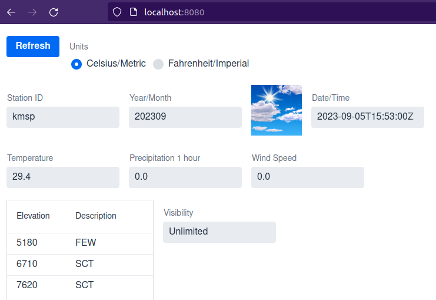

# WeatherApp
A simple weather application written in Java 21; intended to be used with the book "Code with Java 21" (BPB Publishing). This application interacts with the National Weather Service (NWS) API, and retrieves data to be served by the application out of an Apache Cassandra database.



## Database

This application requires a running [Astra DB](https://astra.datastax.com) cloud database. The "free tier" of Astra DB should provide more than enough resources to run the application. If the Astra database is "hibernated," it will need to be "resumed" before running the applicaiton.

_Note: As of this writing, only databases created on the Google Cloud Platform (GCP) provider qualify for Astra DB's free tier._

In the book "Code with Java 21," the keyspace is named "weatherapp." Really, the keyspace can be named anything, but its name needs to be reflected in the **ASTRA_DB_KEYSPACE** environment variable.

Whatever the name of the keyspace, it should have the following Cassandra table created within:

```sql
CREATE TABLE weather_by_station_by_month (
    station_id TEXT,
    month_bucket INT,
    reading_timestamp TIMESTAMP,
    reading_icon TEXT,
    station_coordinates_lat FLOAT,
    station_coordinates_lon FLOAT,
    temperature_c FLOAT,
    wind_direction_deg INT,
    wind_speed_kmh FLOAT,
    wind_gust_kmh FLOAT,
    visibility_m INT,
    precipitation_last_hour FLOAT,
    cloud_cover MAP<INT,TEXT>,
    PRIMARY KEY ((station_id,month_bucket),reading_timestamp)
) WITH CLUSTERING ORDER BY (reading_timestamp DESC);
```

A token from an appropriately-scoped role is required. As this application use Spring Data underneath, the application role should be "Database Administrator." This is because Spring Data needs the ability to create tables, even if instructed not to do so.

## Environment:

This application requires the following environment variables to be set:

 - **ASTRA_DB_KEYSPACE** - The database keyspace containing the tables required by the Weather Application.
 - **ASTRA_DB_REGION** - The cloud region of the database.
 - **ASTRA_DB_ID** - The identifier of the database.
 - **ASTRA_DB_APP_TOKEN** - The token obtained from Astra DB.

In a Mac/Linux environment, the environment varaibles can be set from a terminal like this (example):

```
export ASTRA_DB_KEYSPACE=weatherapp
export ASTRA_DB_REGION=us-east1
export ASTRA_DB_ID=31111111-1111-4111-1111-111111111111
export ASTRA_DB_APP_TOKEN=AstraCS:BxinhBlahBlahBlahFHqKZw:d6532818082NotARealTokenc18d40
```

In a Windows environment, the environment variables can be set from the commmand line like this:

```
set ASTRA_DB_KEYSPACE=weatherapp
set ASTRA_DB_REGION=us-east1
set ASTRA_DB_ID=31111111-1111-4111-1111-111111111111
set ASTRA_DB_APP_TOKEN=AstraCS:BxinhBlahBlahBlahFHqKZw:d6532818082NotARealTokenc18d40
```


## To build:

### Build Requirements

 - Java 21 (JDK)
 - Maven

### Build command

    mvn clean install

### Running the build

    mvn spring-boot:run

## Usage:

The Weather Application has restful endpoints which allow it to both fetch and display data. When the application first comes up, it will not show any data. To remedy this, click the "Refresh" button. If data is present for the current month, the most-recent weather reading will be displayed. If there is no data for the current month, nothing will be displayed.

_Note: The station code of "kmsp" (for the Minneapolis/St. Paul International Airport) is the default in this application. Additional station codes can be found on this NWS page: [https://forecast.weather.gov/stations.php?foo=2](https://forecast.weather.gov/stations.php?foo=2), such as "knyc" (for New York City's Central Park weather station. _

### Loading Data:

The most-recent reading from the NWS can be loaded into the application by invoking the following _PUT_ endpoint (Weather Application needs to be running): [http://127.0.0.1:8080/weather/latest/station/kmsp](http://127.0.0.1:8080/weather/latest/station/kmsp).  This can be run using the [curl](https://www.curl.se) utility:

    curl -X PUT http://127.0.0.1:8080/weather/latest/station/kmsp

### Viewing Data:

In addition to the user interface, the most-recently loaded weather reading from the NWS (stored in the Weather Application's database) can be viewed on the following _GET_ endpoint: [http://127.0.0.1:8080/weather/latest/station/kmsp/month/202307](http://127.0.0.1:8080/weather/latest/station/kmsp/month/202307).  Note that the month is specified in the `YYYYMM` format.

    curl -X GET http://127.0.0.1:8080/weather/latest/station/kmsp/month/202307

