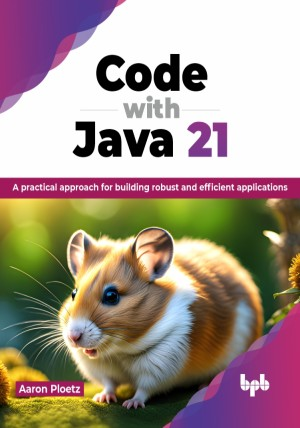

# Code with Java 21

Building modern applications with Java

This is the repository for [Code with Java 21
](https://bpbonline.com/products/code-with-java-21?variant=43124374044872),published by BPB Publications.

## About the Book
Code with Java 21 is a practical journey through one of the world’s most prolific computer programming languages. It is meant to help readers build up their knowledge of common Java programming constructs, data structures, and engineering paradigms. Filled with real-world examples, this book aims to build the reader’s understanding of building software applications with Java.

Seasoned Java developers should buckle in as this book takes a hands-on approach to leveraging popular Java frameworks like Spring and Vaadin to build rich, feature-filled web applications. It also covers building powerful data-driven applications on enterprise-grade databases like PostgreSQL and Apache Cassandra®. This book will also show how to use Java to animate with colorful graphics and even build a simple arcade game.

Around the world, Java runs on billions of devices. After its inception nearly 30 years ago, it remains one of the most popular and sought-after programming languages. Whether you are an aspiring computer hobbyist or want to gain a valuable skill en route to a lucrative career as a software developer, Code with Java 21 should be every developer’s go-to reference for building Java applications.

## What You Will Learn
• Learn fundamental programming structures with Java.

• Explore the new features of Java 21.

• Build Java applications with databases like PostgreSQL and Apache Cassandra®.

• Learn how to build graphics and simple animations with Java.

• Leverage frameworks like Spring Boot and Spring Data.

• Build fully-featured web GUIs with Vaadin.
